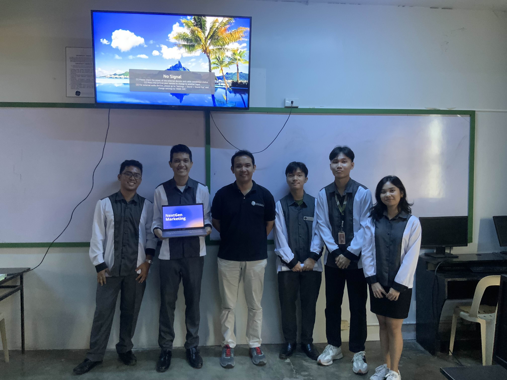

# NextGen

NextGen is a digital marketplace designed to connect businesses with a wide range of promotional services, including collaborations with content creators, influencers, celebrities, marketing professionals, and affiliates. Enabling them to leverage the power of digital marketing to effectively promote their products or services.

This is also our New Venture Project where we have to make a Business Proposal and a Prototype.

### Start

If you ever want to try out the prototype.

Enter the following commands and make sure you are inside the directory.

```
$ npm install

$ npm run build

$ npm run start
```

## PHBD (Philippine Basement Dwellers)

### Members

- Almighto Basadre
- Edrian Cancino
- Kristine Lhei Columbres
- Marcel Paolo Magbual
- Adrian Signo

<br>


